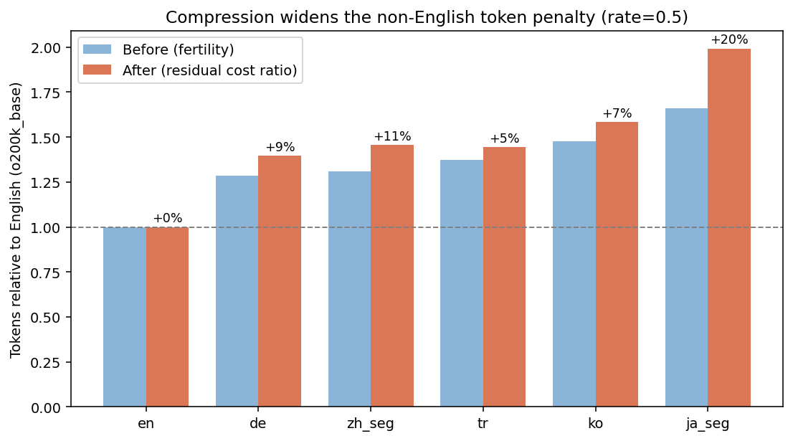
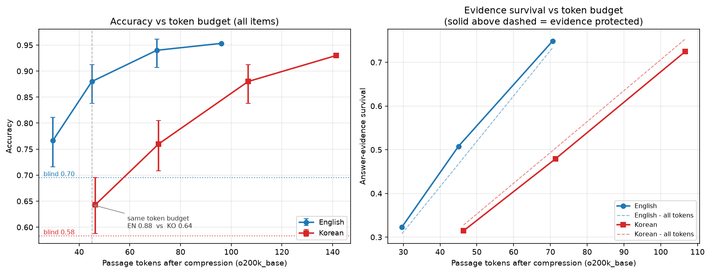
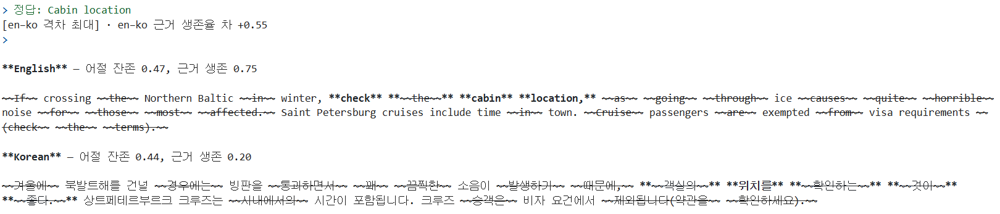

# KorPress

📢 2026년 여름학기 [AIKU](https://github.com/AIKU-Official) 활동으로 진행한 프로젝트입니다.
🏆 2026년 여름 AIKU 프로젝트 **1등 수상**

KorPress는 한국어 문장을 **구문(span)** 단위로 압축하는 prompt compressor입니다. Stanza 의존구문 분석으로 span 후보를 만들고, KLUE-RoBERTa로 각 span의 KEEP/DROP 확률을 예측합니다.

## Introduction

RAG와 long-context LLM은 검색한 문서나 긴 대화를 prompt에 포함하기에 token 비용과 추론 시간이 증가합니다. 때문에 Prompt Compressor를 통해서 입력 텍스트나 문서에서 불필요한 토큰을 제거하지만, 이러한 방식은 언어마다 토큰 효율성(token efficiency)이 다르기 마련입니다.



한국어는 영어보다 동일한 내용을 표현할 때 더 많은 토큰을 사용합니다. 이는 학습 데이터셋 비율의 차이와 언어 구조 상의 차이로 인해 발생합니다. 대표적인 multilingual compressor인 [LLMLingua-2](https://aclanthology.org/2024.findings-acl.57/)를 분석한 결과, 압축 이후에도 한국어의 상대 token 비용이 줄어들지 않았고 동일한 token 예산에서 영어보다 많은 정보를 잃었습니다.



이는 Belebele 영어<->한국어 병렬 독해에서도 마찬가지였습니다. 토큰 수가 한정될수록, 한국어는 같은 정보를 4배 더 일어버리는 현상이 발생하였습니다.



압축문을 살펴보면 정답 근거를 구성하는 표현과 어절 간 연결 관계가 함께 사라지는 사례가 나타났습니다. 이와 같은 점은 교착어적인 특성을 가지고 있는 한국어에선 치명적인 성능 저하로 이어질 수 있습니다. 이에 KorPress는 압축 단위를 토큰에서 여러 어절로 구성된 구문, span으로 확장하였습니다.

## Methodology
### Overview
KorPress는 여러 어절로 구성된 span을 압축 단위로 사용합니다. 입력 문장에서 각 span의 삭제 가능성인 $p_{DROP}$을 예측하고, 높은 점수를 받은 span을 삭제하여 압축문을 생성하였습니다. 추론 단계에선 하이퍼파라미터인 `L`, `drop_rule`, `threshold τ`에 따라 압축 강도를 조절합니다.

### Span Candidate Construction
먼저 문장을 어절 단위로 나눕니다.
$x = (w_1, w_2, ..., w_n)$

그 후, Stanza 의존구문 분석기를 사용해 dependency tree를 얻습니다. 해당 tree에서 부모-자식으로 연결된 어절 구간을 span 후보로 만듭니다.

$s_{i:j} = (w_i, ...m w_j), \ 1 \leq |s_{i:j}| \leq L$

예를 들어, `철수는 어제 학교에 갔다`라는 문장이 있다면 $L = 2$일 때 다음과 같은 후보가 생성됩니다.
- `{철수는, 어제, 학교에 갔다, 철수는 어제, 어제 학교에, 학교에 갔다}`
  
따라서 문장 하나는 길이가 다른 여러 span이 중첩된 span tree 구조를 갖게 됩니다.
학습 시에는 생성된 모든 span 후보를 학습 데이터에 포함시킵니다. 따라서 부모 span과 자식 span은 각각 독립적인 KEEP/DROP 라벨을 갖습니다.

### Span Representation
KLUE-RoBERTa-base의 경우 토큰 기반으로 작동하기 떄문에 span 단위를 학습하기 위해선 서브워드의 임베딩 벡터를 묶어서 봐야합니다. 즉, 하나의 span에 여러 개의 subword vector가 있으므로 span representation을 계산할 필요가 있습니다. 
$T_s = {h_1, h_2, ..., h_k}$

span representation의 경우, subword token vector의 전체적인 의미와 두드러지는 특징을 살펴보기 위해 mean pooling과 max pooling을 concat하여 사용합니다.

$h_s^{mean} = \frac{1}{|T_s|}\sum_{t \in T_s}h_t$
$h_s^{max}[k]= \max_{t\in T_s}h_t[k]$
$z_s = [h_s^{mean};h_s^{max}]$

### Training
전체적인 학습 과정은 [LLMLingua-2](https://aclanthology.org/2024.findings-acl.57/)를 참조하였습니다.
GPT-5.6-sol-high를 teacher model로 사용해 각 span에 KEEP 또는 DROP 라벨을 생성합니다. 이후 MLP classifier와 encoder를 fine-tuning하며 span별 corss-entropy loss로 DROP 확률을 학습하게 됩니다.

$p_s=\mathrm{softmax}(f_\theta(z_s))$
$\mathcal{L} = -\sum_s \log p_\theta(y_s|z_s)$

학습 데이터의 경우에는 [AI Hub 한국어 강의 발화 데이터](https://www.aihub.or.kr/aihubdata/data/view.do?aihubDataSe=data&currMenu=11&dataSetSn=71627&topMenu=)의 train split을 사용하였고, Stanza로 생성한 모든 span에 KEEP/DROP label을 부착하였습니다.

### Compression
추론 시에도 학습과 동일하게 Stanza로 구문분석하여 span 후보를 생성합니다. 그 후 학습된 encoder가 각 span의 $p_{DROP}$을 계산합니다.
하나의 어절 $w_i$은 여러 개의 span에 포함될 수 있으므로, span별 DROP 확률을 어절 단위 삭제 점수로 통합하였습니다. 어절 $w_i$를 포함하는 span 집합을 

$S_i = {s | w_i \in s}$라고 하자.

#### Max
$q_i^{max} = max_{s \in S_i} p_{DROP}(s)$

어절을 포함하는 span 중 하나라도 높은 DROP 확률을 가지면 해당 어절을 삭제한다.

#### Mean
$q_i^{mean} = \frac{1}{|S_i|}\sum_{s \in S_i}p_{DROP}(s)$

어절을 포함하는 모든 span의 DROP 확률을 평균내어 삭제 여부를 결정한다.

#### Min
$q_i^{\mathrm{min}}=
\min_{s\in\mathcal{S}_i}p_{\mathrm{DROP}}(s)$

어절을 포함하는 span 중 가장 낮은 DROP 확률을 사용한다. 따라서 집합 내 모든 span이 해당 어절을 불필요하다고 판단해야 삭제된다.

각 어절의 DROP 점수를 기준으로 KEEP/DROP 결정을 수행한다. Intrinsic 평가에서는 threshold τ를 사용하고, QA 평가에서는 목표 retention-rate에 맞춰 삭제 후보를 선택한다.

### Hyperparameters
학습에 사용한 하이퍼파라미터는 다음과 같습니다.

| Hyperparameters | Values |
|---|---|
| hidden size | 256 |
| Dropout | 0.1 |
| Maximum sequence length | 512 |
| Epochs | 3 |
| Batch size | 2 |
| Gradient accumulation | 8 |
| Learning rate | \(2\times10^{-5}\) |
| Weight decay | 0.01 |
| Warmup ratio | 0.06 |
| Precision | FP16 |
| Seed | 42 |

## Experiments
KorPress의 효과를 평가하기 위해 Intrinsic 평가와 QA Task 평가를 진행하였습니다. Intrinsic 평가를 통해 $L$, drop rule, threshold가 압축률 및 정보 보존에 미치는 영향을 분석합니다. 이후 QA Task 평가를 통해 동일한 삭제율에서 Span compressor가 Token Compressor보다 QA Context를 잘 보존하는지 검증합니다.

### Intrinsic Evaluation
Intrinsic 평가는 AI Hub 한국어 대학 강의 발화 데이터의 validation split 418개 문장을 대상으로 수행하였습니다. 실험 조건은 다음과 같습니다.

| Variable | Values |
|---|---|
| Maximum span length \(L\) | 1, 2, 4, 8 |
| Drop rule | Max, Mean, Min |
| Threshold \(\tau\) | 0.5, 0.7, 0.9 |

압축 결과는 다음 지표로 평가하였습니다.
- Qwen3-8B tokenizer 기준 토큰 삭제율
- 어절 삭제율
- BGE-m3-ko 기반 의미 유사도
- 숫자, 날짜, 부정표현의 보존율

### QA Task Evaluation
QA 평가는 KorQUAD 2.0의 694개 질의응답 쌍을 대상으로 수행했습니다. 압축된 context를 Qwen3-8B에 입력하고 EM과 F1을 계산하였습니다.
QA에서는 threshold 대신 retention rate를 사용하였는데, 원문 token 수를 $N_{original}$, 목표 rate를 $p$라고 할 때 다음과 같이 계산합니다.

$N_{target} = round(pN_{original})$

실험 조건은 다음과 같습니다.
| Method | Conditions |
|---|---|
| retention rate | \(0.9, 0.8, 0.7\) |
| Span | \(L=1,2,4,8\) × Max / Mean / Min |
| Reader | Qwen3-8B |
| Metrics | EM, F1 |

## Results
### Intrinsic Evaluation
Intrinsic 평가에서는 threshold, drop rule, $L$에 따른 압축률과 정보 보존율의 변화를 분석하였습니다.

#### Threshold effect
$L = 8$ 기준
| Threshold τ | Drop rule | Deletion rate (%) | Semantic similarity | Number retention (%) | Date retention (%) | Negation retention (%) |
|---:|:---:|---:|---:|---:|---:|---:|
| 0.5 | Max | **38.84** | 0.9296 | 77.54 | 85.48 | 60.21 |
| 0.5 | Mean | **28.72** | 0.9531 | 82.94 | 85.48 | 70.54 |
| 0.5 | Min | **23.42** | 0.9633 | 86.83 | 88.71 | 75.35 |
| 0.7 | Max | 25.27 | 0.9609 | 89.09 | 87.10 | 75.82 |
| 0.7 | Mean | 16.86 | 0.9764 | 92.66 | 91.94 | 83.45 |
| 0.7 | Min | 14.20 | 0.9804 | 93.84 | 93.55 | 85.92 |
| 0.9 | Max | 12.64 | **0.9813** | **98.27** | **95.16** | **90.61** |
| 0.9 | Mean | 7.42 | **0.9903** | **99.14** | **98.39** | **93.19** |
| 0.9 | Min | 6.39 | **0.9915** | **99.57** | **100.00** | **94.25** |

Threshold가 높아질수록 DROP 판정 조건이 엄격해져 삭제율은 감소하고 의미 보존율은 증가하였습니다.

#### Drop Rule Effect
$L=8, τ=0.5$ 기준
| Drop rule | Deletion rate (%) | Semantic similarity | Number retention (%) | Date retention (%) | Negation retention (%) |
|:---:|---:|---:|---:|---:|---:|
| Max | **38.84** | 0.9296 | 77.54 | 85.48 | 60.21 |
| Mean | 28.72 | 0.9531 | 82.94 | 85.48 | 70.54 |
| Min | 23.42 | **0.9633** | **86.83** | **88.71** | **75.35** |

동일한 $L$과 threshold에서 삭제율은 전반적으로 다음 순서를 보였습니다.

$\text{Max}>\text{Mean}>\text{Min}$

#### Span Length Effect
$τ=0.5$ 기준
| Span length L | Drop rule | Deletion rate (%) | Semantic similarity | Number retention (%) | Date retention (%) | Negation retention (%) |
|---:|:---:|---:|---:|---:|---:|---:|
| 1 | Max | 37.76 | 0.9326 | 78.40 | 85.48 | 62.32 |
| 1 | Mean | 37.76 | 0.9326 | 78.40 | 85.48 | 62.32 |
| 1 | Min | 37.76 | 0.9326 | 78.40 | 85.48 | 62.32 |
| 2 | Max | 38.27 | 0.9313 | 77.97 | 85.48 | 61.50 |
| 2 | Mean | 35.94 | 0.9374 | 79.81 | 85.48 | 63.97 |
| 2 | Min | 33.43 | 0.9447 | 81.64 | 85.48 | 66.67 |
| 4 | Max | 38.57 | 0.9305 | 77.65 | 85.48 | 60.80 |
| 4 | Mean | 32.66 | 0.9457 | 81.10 | 85.48 | 67.14 |
| 4 | Min | 28.52 | 0.9542 | 83.80 | 85.48 | 70.19 |
| 8 | Max | **38.84** | 0.9296 | 77.54 | 85.48 | 60.21 |
| 8 | Mean | 28.72 | 0.9531 | 82.94 | 85.48 | 70.54 |
| 8 | Min | 23.42 | **0.9633** | **86.83** | **88.71** | **75.35** |

$L$의 효과는 drop rule에 따라 다르게 나타났다. $\tau=0.5$에서 $L$을 1에서 8로 증가시켰을 때 Max의 삭제율은 37.76%에서 38.84%로 소폭 증가하였습니다. 반면 Mean은 37.76%에서 28.72%, Min은 37.76%에서 23.42%로 감소하였습니다. 따라서 $L$은 독립적으로 해석하기보다 drop rule과의 상호작용으로 해석해야 합니다. Max에서는 긴 span이 추가적인 삭제 기회를 제공하지만, Mean과 Min에서는 긴 span의 KEEP 판단이 해당 어절을 보호하는 효과를 보였습니다.

### QA Task Evaluation
QA 평가에서는 694개 KorQuAD 질의응답을 대상으로 Token과 Span 압축을 비교하였습니다. QA에서는 threshold 대신 목표 retention rate를 사용하였습니다.

| Target retention | Token EM / F1 | Best Span EM / F1 | EM gain / F1 gain |
|---|---|---|---|
| 0.9 | 61.24 / 71.90 | 72.77 / 80.61 | +11.53 / +8.71 |
| 0.8 | 47.41 / 57.81 | 69.31 / 76.82 | +21.90 / +19.01 |
| 0.7 | 36.74 / 46.32 | 64.99 / 72.39 | +28.25 / +26.07 |

모든 retention rate 조건에서 Span 압축은 Token 압축보다 높은 EM과 F1을 보였습니다. 특히 압축이 강해질수록 Span의 상대적 이점이 커졌습니다. 이는 동일한 token budget에서 여러 어절로 구성된 span을 삭제 단위로 사용하는 것이 개별 subword를 삭제하는 것보다 QA에 필요한 문맥과 표현을 더 잘 보존할 가능성을 보여줍니다.

다만 retention rate가 낮아질수록 모든 방법의 성능은 감소했으며, 모든 조건에서 하나의 $L$이나 drop rule이 일관되게 최적이지는 않았습니다. 

## Conclusion

KorPress는 한국어 문장을 구문 span 단위로 압축하여, 문법적 단위와 핵심 정보 보존을 목표로 합니다.

Intrinsic 평가에서는 threhold가 낮아질수록 삭제율이 증가하고 의미 유사도와 숫자, 날짜, 부정 표현의 보존율이 감소하였습니다. 또한 Max는 가장 공격적인 압축을, Min은 가장 보수적인 압축을 수행했습니다. Span length의 효과는 drop rule에 따라 달라졌으므로, 하나의 $L$이나 rule이 모든 조건에서 최적이라고 보기는 어렵습니다.

QA task에서는 동일한 retention 조건에서 Span compressor가 Token compressor보다 모든 조건에서 높은 EM과 F1을 보였습니다. 특히 목표 retention 0.7에서 Span의 최고 성능은 EM 64.99, F1 72.39로 Token보다 각각 28.25%p, 26.07%p 높았습니다.

종합하면, , KorPress는 한국어 prompt compression에서 압축 단위를 token에서 span으로 전환하는 것이 QA에 필요한 정보를 보존하는 데 유리할 수 있음을 보여줍니다.

## Limitations

- 평가에 사용한 표본의 규모가 제한적입니다.
- QA 외에 Summarization과 같은 다른 downstream task에서의 검증이 부족합니다.
- 압축 결과의 자연스러움과 문맥 적절성을 LLM-as-a-Judge 또는 사람 평가로 검증하지 못했다.
- token compression의 근본적인 목적은 인공지능에게 전달하는 토큰 수를 줄이는 것입니다. 따라서 인공지능이 언어를 이해하는 방식이 인간과 유사하다는 전제가 존재합니다.


## Installation

Python 3.10 이상과 CUDA GPU 환경을 권장합니다.

```bash
python -m venv .venv
source .venv/bin/activate
pip install -r requirements.txt
```

Windows PowerShell에서는 다음과 같이 실행합니다.

```powershell
python -m venv .venv
.venv\Scripts\Activate.ps1
pip install -r requirements.txt
```

Stanza 한국어 모델은 최초 실행 시 한 번 내려받습니다.

```bash
python -c "import stanza; stanza.download('ko')"
```

## Usage

### Intrinsic Evaluation

```bash
python intrinsic/prepare_aihub_input.py --input chunks.csv --out-dir prepared/input
python intrinsic/build_span_candidates.py --input prepared/input/sentences.txt --metadata prepared/input/metadata.csv --output prepared/span_candidates.json
python intrinsic/prepare_span_data.py --chunks chunks.csv --spans span_labels.csv.gz --output-dir prepared/aihub
python intrinsic/train_span_encoder.py --data-dir prepared/aihub --chunks chunks.csv --output-dir runs/span_encoder --model-name klue/roberta-base --pooling mean_max --precision fp16
python intrinsic/predict_span_encoder.py --checkpoint runs/span_encoder/best_model --data prepared/aihub/validation.jsonl --chunks chunks.csv --output runs/span_encoder/validation_predictions.csv.gz
python intrinsic/run_intrinsic_experiment.py --chunks chunks.csv --span-records prepared/aihub/validation.jsonl --span-predictions runs/span_encoder/validation_predictions.csv.gz --output-dir intrinsic/results/qwen3_8b --qwen-model Qwen/Qwen3-8B --drop-rules max mean min
```

### QA Task Evaluation

```bash
python qa_task/prepare_korquad_dev.py --output-dir data/korquad_dev --hf-dataset LGCNS/KorQuAD_2.0 --hf-split validation --tokenizer Qwen/Qwen3-8B --max-context-tokens 3000 --max-questions 0 --seed 42 --download-stanza
python intrinsic/predict_span_encoder.py --checkpoint runs/span_encoder/best_model --data data/korquad_dev/spans.jsonl --chunks data/korquad_dev/chunks.csv --output data/korquad_dev/span_predictions.csv.gz --batch-size 4 --max-length 512
python qa_task/run_korquad_qa_experiment.py --chunks data/korquad_dev/chunks.csv --qa-pairs data/korquad_dev/qa_pairs.json --span-records data/korquad_dev/spans.jsonl --span-predictions data/korquad_dev/span_predictions.csv.gz --token-checkpoint runs/token_klue_roberta_base/best_model --output-dir qa_task/results/qwen3_8b --qwen-model Qwen/Qwen3-8B --torch-dtype float16 --max-questions 0 --retention-rates 0.9 0.8 0.7 --span-L 1 2 4 8 --drop-rules max mean min
```

### Token Efficiency

```bash
python token_efficiency/run_token_efficiency.py self-check
python token_efficiency/run_token_efficiency.py sample
python token_efficiency/run_token_efficiency.py compress
python token_efficiency/run_token_efficiency.py evidence
python token_efficiency/run_token_efficiency.py evaluate
python token_efficiency/run_token_efficiency.py metrics
python token_efficiency/run_token_efficiency.py plot
```

세부 입력 형식과 실험별 주의사항은 각 디렉터리의 README를 참고합니다.


## References

- [LLMLingua-2: Data Distillation for Efficient and Faithful Task-Agnostic Prompt Compression](https://aclanthology.org/2024.findings-acl.57/)
- [Language Model Tokenizers Introduce Unfairness Between Languages](https://arxiv.org/abs/2305.15425)
- [KLUE-RoBERTa](https://huggingface.co/klue/roberta-base)
- [Stanza](https://stanfordnlp.github.io/stanza/)
- [Belebele](https://huggingface.co/datasets/facebook/belebele)
- [KorQuAD](https://korquad.github.io/)

## Team

김상민 · 여승민 · 엄세연 · 유주연 · 이다슬 · 이윤호
